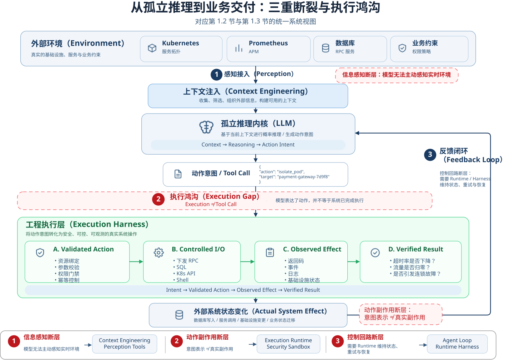

# 第1章 从 LLM 到 Agent：现代 Agent 的系统模型

## 1. 现实断层：确定性逻辑的边界与执行鸿沟

### 1.1 确定性逻辑的边界与计算范式演进

半个世纪以来，现代软件工程的核心方法论始终建立在**确定性控制逻辑**之上。从过程式程序中的条件分支，到有限状态机、控制流图（Control Flow Graph），再到关系型数据库的 ACID 事务与复杂的分布式工作流，经典软件系统都遵循一个共同原则：**由工程师预先定义系统的控制规则，由计算机严格按照规则完成状态转移。**

从抽象意义上看，这类计算过程可以表示为：

$$(S_t, I_t) \xrightarrow{\quad f \quad} (S_{t+1}, O_t)$$

系统在当前状态 $S_t$ 下接收外部输入 $I_t$，经由预设的业务逻辑 $f$，迁移至新状态 $S_{t+1}$，并向外部输出结果 $O_t$。

方便理解的版本：

$$f(\text{Input}, \text{State}) \rightarrow (\text{Output}, \text{State}')$$

**在这套范式中，决定系统如何流转状态的分支规则，在编译期或设计期就必须被显式锁定。**

> 这里的“确定性”，并不假设物理世界是静态或平稳的，也不意味着所有可能状态都必须被逐一枚举，相反，高可用系统设计中充斥着网络瞬时超时、并发数据竞争、机器宕机与不可控的异常输入。**确定性的真正本质在于：决定系统如何解析输入、如何判定分支跳转，以及在遭遇异常时如何回滚或降级的控制逻辑 $f$，原则上必须由工程师在设计期或编译期显式编码锁定。**
>
> 从关系型数据库的预写日志（WAL）与两阶段提交，到微服务编排中的 Saga 事务补偿与有限状态机，整套经典体系的核心优势在于**高可测试性、行为可预期与严格的形式化验证**。无论系统拓扑多么庞大，其控制流在宏观上始终遵循一条铁律：**人类工程师负责定义状态转移规则，计算设备机械的执行转移规则。**

然而，当这套体系直面开放现实世界中的非结构化意图与高度模糊的需求时，工程穷举的边际成本开始呈现指数级暴增。现实业务并非由标准结构体（Struct）组成，而是充斥着模糊的自然语言、突发异常的物理环境以及动态演变的业务策略。传统的工程妥协方案是编写成千上万行复杂的正则表达式与层层嵌套的 `if-else` 分支，但最终系统仍不可避免地滑向软件熵增的深渊：代码越来越脆弱，边界维护成本超越了业务本身的价值。

这构成了经典软件范式的**第一道工程边界**：

**确定性程序极其擅长在封闭边界内执行已被形式化描述的逻辑，却极难依靠有限的显式规则，覆盖一个开放、动态且无法在设计期被充分结构化的问题空间。**

为了突破这一边界，计算范式经历了由浅入深的演进：

首先，统计机器学习与深度学习的发展，部分松动了系统对人工显式规则的依赖。工程师不再需要手写几何特征来识别目标，或是编写海量过滤规则来计算反欺诈分值，而是通过损失函数与反向传播，在高维隐空间中拟合复杂的映射关系。

而在规则极其清晰的封闭受限环境（如围棋棋盘或物理模拟引擎）中，强化学习（RL）更进一步证明：系统能够在给定的状态与动作空间内，通过与环境的高频试错，自主探索出超越人类经验的复杂决策策略。

然而，这类范式并没有真正改变软件工程的控制权边界。

无论是图像分类模型输出类别概率、风控模型输出风险评分，还是强化学习在预设的动作列表里挑选操作，它们都有一个共同的前提：**问题的输入格式、输出语义以及系统能够采取的动作，依然全部由工程师在离线阶段用代码严格框死。**

AlphaGo 哪怕探索出超越人类的棋路，它的决策也只能映射为棋盘上固定坐标的落子，它无法理解棋盘之外的任何现实逻辑，更无法根据当前局势动态调用搜索引擎或跨系统接口。它们本质上依然是高度特化的“专用型计算算子”，**缺少面向开放业务环境的复杂意图理解、长程上下文推导与跨系统的动态工具协同能力**。

大语言模型（LLM）的出现，改变了这一格局。

基于 Transformer 架构与海量多样性语料预训练的大语言模型，使自然语言与非结构化语义首次成为一种通用的计算界面。**非结构化输入的解析、上下文关联与多跳逻辑推导，第一次无需下游预先编写特定的解析代码，而是直接由模型在运行时（Runtime）动态完成。**

在过去，系统必须依赖人类将上述运维场景拆解为严格参数化的请求：

Plaintext

```
{
  "action": "INSPECT_SERVICE_METRICS",
  "service_id": "payment-core",
  "time_window_minutes": 15,
  "metrics": ["upstream_timeout_rate", "risk_intercept_rate"],
  "route_failover_enabled": true
}
```

而在现代大语言模型的语义空间中，系统可以直接输入原始的自然语言、实时日志片段与监控趋势。模型能够在运行时解析出业务上下文中的核心实体，推导出依赖顺序，并提出合理的排查步骤。软件系统的能力边界，由此从“执行预定义的确定性规则”，跨越到了“在开放语境中推导决策”。

但这仅仅解决了复杂问题交付的前半段。

模型在运行时能够理解“应该排查支付链路”，能够推断出“下一步需要比对网关返回码 504 的占比与风控系统的拦截日志”，甚至能够生成完全正确的 SQL 查询语句或 Shell 脚本。

然而，**在一次前向传播（Forward Pass）的自回归计算中推导出“应该做什么”，与在物理生产环境中“把事情做完”之间，存在着根本性的本质断裂。**

大语言模型推导出的所有精妙逻辑，其物理表现仅仅是自回归生成的一组文本 Token。在缺乏外围宿主系统支撑的前提下：

- **模型权重中没有实时运行状态**：无论预训练与指令微调多么充分，静态模型无法主动感知当前生产集群的实时健康度、线程池负载与网络拓扑；
- **文本输出不具备物理能力**：模型生成的文本 Token 无法自行转化为套接字（Socket）上的网络 I/O，无法直接向生产数据库发送更新语句，也无法真正向网关下发路由切换指令；
- **单次推理不具备事务与重试闭环**：模型调用本身是无状态的，在遭遇下游接口鉴权失败、RPC 调用超时或数据格式漂移时，它无法自行维护一个跨生命周期的状态机来实现重试、回滚与容错自愈。

当大语言模型跨越了“语义理解与推理”的边界之后，**第二道工程边界**随之浮现：

> **从非结构化语义的推导演算，到物理环境中的实际状态变更，中间横亘着一道无法仅靠堆叠参数量或优化提示词跨越的执行鸿沟（Execution Gap）。**

要理解为什么再聪明的模型也无法独自跨过这道鸿沟，必须深入系统底层，审视单次模型调用在计算机体系中的物理真相。

### 1.2 孤立推理内核与真实业务断裂

当大语言模型从非结构化文本的“内容生成”进入“自主业务执行”场景时，一个根本性的系统断层开始显现：**模型的语义推理能力，并不天然等价于物理系统的执行交付能力。**

在 1.1 节中，我们将经典确定性系统的流转过程抽象为确定的映射函数：

$$f(\text{Input}, \text{State}) \rightarrow (\text{Output}, \text{State}')$$

而在现代大语言模型的计算视界中，单次模型调用的本质是一个**孤立的概率推导内核**。在给定上下文序列 $X$ 的条件下，模型按照自回归（Autoregressive）方式逐步计算后续 Token 的条件概率分布，并据此采样生成输出序列：

$$P(y \mid X) = \prod_{t=1}^{T} P(y_t \mid X, y_{1:t-1}), \quad y \sim P_\theta(y \mid X)$$

> 说明：这个公式此处不需要深究公式本身，大概看一下下面的解释即可。
>
> 拆开看就很简单，先看前半部分 $$P(y \mid X) = \prod_{t=1}^{T} P(y_t \mid X, y_{1:t-1})$$
>
> 假设：
>
> - $X$：用户输入，例如“帮我排查支付故障”
> - $y$：模型最终生成的整段回答
> - $y_t$：回答里的第 $t$ 个 Token
> - $y_{1:t-1}$：在第 $t$ 个 Token 之前已经生成的历史 Token 序列
>
> 那么：$$P(y_t \mid X, y_{1:t-1})$$
>
> 意思就是：
>
> > **已知用户输入 $X$，以及前面已经生成的内容，下一个 Token 是 $y_t$ 的概率是多少。**
>
> 后面这个：$$y \sim P_\theta(y \mid X)$$
>
> 其中 $\theta$ 就是模型参数。
>
> 整个式子翻译下就是：
>
> > **给定上下文 $X$，模型根据参数 $\theta$ 所定义的概率分布生成输出 $y$。**

无论上层接口采用常规请求响应、流式传输（Streaming）还是全双工长连接，一次孤立的模型推理在业务语义上仍然只是一次计算过程：**它本身不具备对外部业务系统产生受控副作用的能力，也不天然拥有跨任务持续存在的业务生命周期。**

模型参数在推理结束后不会因本次业务交互而自动产生持久化变更；所谓的会话上下文、任务历史与长期状态，在物理上全部依托于外围系统的存储管理与重新注入。

为了看清这种孤立推理内核与现实生产环境的本质冲突，我们推演一个典型的分布式 SRE 故障排查场景：

> **运维指令**：“排查过去 15 分钟内支付核心网关超时率突增的异常节点，拉取错误堆栈并比对慢查询，隔离故障实例，并向应急指挥群发送处置摘要。”

面对这一复杂的工业级任务，若仅仅依赖单体模型进行处理，无论底层模型的推理能力多么强大，整个交付链路也会在物理世界中遭遇三重结构性断裂：

#### 1.2.1 信息感知断层：被动上下文与实时环境的割裂

单独运行的模型对外部环境本质上是**被动且静态**的。在缺乏外部探针与动态数据注入的前提下：

- 模型参数承载的是训练与后训练阶段形成的参数化知识，本身无法自动反映当前生产环境中的实时状态；
- 单体模型既无法主动向 Kubernetes API Server 轮询 Pod 的实时生命周期状态，也无法自行连接 Prometheus、Datadog 抓取时序监控指标，更无法透视 APM 分布式追踪系统中的动态调用拓扑。

模型不具备面向物理环境的**主动数据摄取通道（Active Data Ingestion Channel）**。在没有外围系统为其主动采集并拼装上下文之前，模型所做的一切逻辑推演，都只能建立在当前上下文所提供的有限信息边界之内。

> **系统收敛指向**：这一信息真空，要求系统架构必须引入 **上下文工程（Context Engineering）** 与 **感知类工具契约（Perception Tools）**，将环境状态主动捕获并注入至模型的瞬时上下文中。

#### 1.2.2 动作副作用断层：决策意图与物理执行的解耦（Decision $\ne$ Execution）

在软件系统中，真正改变外部业务状态，最终都需要落实为某种可执行的副作用（Side Effects）——调用系统接口、发送网络数据包、写入持久化存储或变更基础设施资源。

大语言模型直接生成的产物，其本质仅仅是 Token 序列或由特定 Schema 编码出的结构化数据（如 JSON 格式的 Tool Call 请求）：

```JSON
{
  "action": "isolate_gateway_instance",
  "target_pod": "payment-gateway-7d9f8-x2k9l",
  "drain_timeout_seconds": 30
}
```

**动作的表示（Representation of Action），绝不等于动作本身。**

模型输出的命令文本或结构化数据，本身无法自行转化为对外部系统的真实调用。它无法自行建立与 Kubernetes API Server 的受认证连接并提交资源变更请求，更无法直接向数据库集群下发连接终止或故障处置指令。模型仅仅完成了“判断应该做什么”的决策阶段，而“把动作落地到真实系统”的执行链条完全处于断开状态。

> **系统收敛指向**：这一执行断裂，要求外围系统提供 **受控执行机制（Execution Runtime）**，负责承接模型的动作意图，并完成参数校验、权限鉴权、协议适配与真实副作用下发；对于代码执行、Shell 操作等高风险能力，还需要进一步引入 **安全沙箱（Sandbox）**。

#### 1.2.3 控制回路断层：瞬时推理生命周期与分布式环境的不确定性

在真实的分布式生产环境中，业务执行从来不是线性的理想路径，而是充斥着瞬时扰动与环境故障：

- 查询监控接口可能遭遇网络抖动引发的超时（HTTP 504 Gateway Timeout）；
- 执行节点隔离时，运维凭证可能因过期导致认证失败（401 Unauthorized），或因策略变更遭遇授权拒绝（403 Forbidden）；
- 执行排查时，可能因目标实例连接池耗尽而直接拒绝建立握手。

对于一次孤立的模型推理而言，一旦本轮生成结束，其推理生命周期即告终止。后续发生的网络异常、权限错误或执行结果，除非由外部系统重新封装进上下文并触发下一轮推理，否则单体模型完全无法继续感知。

单体模型缺乏“执行动作 $\to$ 观察环境反馈 $\to$ 捕获运行时异常 $\to$ 调整决策”的持续闭环能力。

> **系统收敛指向**：这一控制真空，要求系统架构必须在其外围构建一个具备持久化状态机的 **运行时支撑体系（Runtime / Harness）**，负责维系执行循环（Agent Loop）、处理异常回灌、管理任务 Checkpoint 与幂等重试。

#### 1.2.4 小结：系统能力的推导映射

将上述三层结构性断裂进行形式化归纳，可以清晰推导出单体模型与真实任务交付之间的能力鸿沟：

单体模型（Model）的能力上限，仅局限于单向的静态映射：

$$\text{Context} \xrightarrow{\quad \text{Reasoning} \quad} \text{Action Intent}$$

而对于需要持续与外部环境交互的自主业务任务，其执行过程可以抽象为一个不断获取反馈并调整动作的离散控制闭环：

$$\text{Observe} \xrightarrow{\quad \text{Reason} \quad} \text{Act} \xrightarrow{\quad \text{Observe} \quad} \text{Reason} \xrightarrow{\quad \text{Act} \quad} \cdots$$

将两者进行结构比对，单体模型向真实系统的跨越，存在着三个不可或缺的核心缺失项：

$$\boxed{\text{感知接入 (Perception)}} \qquad \boxed{\text{动作落地 (Execution)}} \qquad \boxed{\text{反馈闭环 (Feedback Loop)}}$$

即：

\[ \text{Model} \rightarrow \begin{cases} 缺感知\\ 缺执行\\ 缺反馈 \end{cases} \rightarrow \text{Context / Execution / Runtime} \]

在系统架构层面，这三大缺口精准收敛到了外围系统的核心工程组件中：

| **结构性断裂**     | **核心缺口**                       | **工程架构承接组件**                                         |
| ------------------ | ---------------------------------- | ------------------------------------------------------------ |
| **信息感知断层**   | 感知接入（Perception） 感知接入    | **Context Engineering & Perception Tools**（环境状态摄取与上下文注入） |
| **动作副作用断层** | 动作落地（Execution）              | **Execution Runtime & Security Sandbox**（参数校验、协议适配与副作用下发） |
| **控制回路断层**   | 反馈闭环（Feedback Loop） 反馈回路 | **Agent Loop & Runtime Harness**（生命周期状态机、异常回灌与容错编排） |

**架构定论**：**从系统工程视角看，大语言模型更适合被视为一种“概率推理协处理器”，而非具备完整感知、执行与生命周期管理能力的独立业务进程。**

它拥有极高密度的非结构化语义解析与规划算力，却天生缺少感知外设、执行驱动与反馈闭环机制。将大语言模型转化为生产级 Agent 的工程本质，并非试图去改变模型底层的自回归机理，而是在其外层构建一套具备确定性契约的工程底座，弥合从**语义决策**到**系统执行**之间的工程断裂。

### 1.3 从文本推理到业务交付：执行鸿沟的本质

在 1.1 与 1.2 节中，我们剖析了孤立概率推导内核与外部系统之间的结构性断裂。面对这种断裂，工业界最直观的工程尝试是为模型挂载“工具调用（Tool Calling / Function Calling）”能力。然而，当系统真正进入生产级业务流转时，大量团队很快撞上了更隐蔽的系统天花板：

**在系统工程视角下，生成一个结构化的工具调用请求，绝不等于完成了一次真实的业务交付。**

许多初学者容易产生一种工程错觉：只要模型能稳定输出一段包含方法名和参数的 JSON，系统就能自然跨越到物理世界。但事实是：

$$\boxed{\text{Execution} \neq \text{Tool Call}}$$

> **Tool Calling 解决的仅仅是“模型如何表达一个动作意图”，而从未解决“系统如何可靠地完成一个动作并达成业务目标”。**

从模型生成一个动作意图，到目标系统产生符合预期的受控状态变更，中间横亘着一段由真实系统复杂性构成的工程断层。我们将这种从**意图表达**跨越到**可验证业务结果**之间的断裂，称为**执行鸿沟（Execution Gap）**。

下图完整刻画了从单体孤立推理到外部系统交付的全局视图，贯通了解构 1.2 节的三重断裂与 1.3 节的受控执行链路：


*图 1-1：从孤立推理到业务交付的统一系统架构视图*

为了弥合这道鸿沟，在生产级 Agent 系统中，一次高风险操作不能仅仅是对外部 API 的简单转发，而是必须经历从意图到结果的完整控制链路：

$$\boxed{\text{Intent} \;\longrightarrow\; \text{Validated Action} \;\longrightarrow\; \text{Observed Effect} \;\longrightarrow\; \text{Verified Result}}$$

依然以第 1.2 节中的典型故障处置场景（隔离异常网关节点）为例，我们可以清晰地透视这四个阶段的工程本质：

#### 1.3.1 意图表示（Intent）：模型“想做什么”

模型在生成过程中产生结构化的动作意图：

JSON

```
{
  "action": "isolate_pod",
  "target": "payment-gateway-7d9f8-x2k9l"
}
```

这仅仅是一串文本符号构成的假设，它不代表任何系统状态的改变。模型不知道这个 Pod 当前是否真实存在，不知道它所属的具体集群与命名空间，更不知道自己是否有权限对它执行变更。

#### 1.3.2 受控动作（Validated Action）：系统“允许它做什么”并完成落地

在意图转化为真实操作之前，外围工程层必须介入，完成严密的合规校验与资源绑定：

- **动作解析与资源绑定**：将抽象意图映射到标准工具协议，查询服务拓扑，确认目标 Pod 归属于生产命名空间 `prod-payment`；
- **参数校验与前置检查**：核实目标 Pod 是否仍处于运行态、排空超时时间是否在安全窗口内（例如必须在 10s 至 60s 之间）；
- **权限与审批门禁**：通过 IAM/RBAC 校验当前 Agent 的凭据范围；判定该动作是否属于不可逆的高危变更，必要时中断自动化链路并触发人工审批（Human Approval Flow）；
- **幂等控制**：对存在重复执行风险的副作用操作建立幂等机制，使同一逻辑动作在遭遇网络抖动或超时重试时，能被目标系统识别和去重，防止二次冲击。

只有完成上述校验和授权，执行器才真正具备向外部系统下发真实 I/O 的条件。

#### 1.3.3 观察效果（Observed Effect）：外部系统“实际发生了什么”

执行器调用 Kubernetes API 执行操作并捕获系统反馈。

但必须警惕：**接口返回调用成功，绝不等于业务目标已经达成。**

API 响应成功可能仅仅代表“请求已被接收”或“Pod 已被下线”，但这只是局部的动作完成。在复杂的分布式系统中，这个动作可能伴随网络丢包、连接耗尽，甚至可能因为并发流量激增而引发其他节点的连锁故障。

系统必须主动收集接口返回码、容器生命周期事件、系统日志等第一手观测数据（Observation）。

#### 1.3.4 结果验证（Verified Result）：这个结果“是不是我们真正想要的”

这是传统脚本系统与高可靠 Agent 最本质的区分点。

Agent 系统必须跨越底层 API 的表层状态，深入业务度量层完成断言验证：

- 检查服务注册中心：该 Pod 的入向流量是否彻底归零？
- 检查监控系统：支付网关的 504 超时率是否真正回落？
- 检查集群拓扑：流量切至其他健康节点后，是否导致剩余实例负载突破熔断水位？

如果验证通过，本次业务交付宣告闭环；如果验证失败（例如超时率未见好转反而加剧），系统必须将这一负向事实作为新的观测输入，重新激活推理内核进入下一轮判断与重试。

**架构定论**

- 在生产级 Agent 系统设计中，执行（Execution）绝不等于工具调用（Tool Call）。

- Tool Calling 解决的只是“模型如何表达一个动作”，而不是“系统如何可靠地完成一个动作”。

- 生产级 Agent 的执行单元，不应该被定义为一次简单的工具调用，而应该被定义为一次涵盖参数校验、资源绑定、权限门禁、受控下发以及业务效度验证的受控状态转移过程。

## 2. 控制权转移：从交互表面到运行时的系统边界

### 2.1 控制流解耦与 Agent Loop 的工程推导

在大语言模型系统中，**Agent 并不是一个拥有完全统一边界的术语**。有些体系将带有工具调用、自动化编排或多步骤执行能力的应用统称为 Agentic System，也有一些体系进一步区分 Workflow 与 Agent。仅凭系统是否接入大模型、是否能够调用工具，甚至是否能够完成多个步骤，都很难准确判断其是否真正具备 Agent 的核心特征。

本书更关注一个底层的工程边界：**模型是否真正进入了任务执行的控制闭环。** 如果任务路径主要由预定义程序驱动，模型只是其中承担理解、生成或判断的一个算子，那么它更接近 AI Workflow；如果模型能够基于当前目标与状态选择下一步 Action，并在获得工具或环境返回的 Observation 后继续调整、重试或终止任务，那么模型已经开始参与运行时的控制流决策，这也是本文讨论 Agent 时采用的核心判断标准。

因此，要理解 Chatbot、Workflow、Copilot 与 Agent 之间的边界，与其纠结产品名称或是否“用了工具”，不如回到软件系统最基本的问题：**谁决定下一步执行什么，以及执行结果如何影响后续决策。**

在系统架构层面，一个现代 AI 系统并非铁板一块，而是由三个不同但相互关联的观察层次构成：

```
┌─────────────────────────────────────────────────────────────────────────┐
│ 交互表面层 (Interaction Surface)                                       │
│ Chat 对话框 / IDE 插件 / GUI 画布 / 无界面 API                          │
└────────────────────────────────────┬────────────────────────────────────┘
                                     │ 用户输入 / 任务目标
                                     ▼
┌─────────────────────────────────────────────────────────────────────────┐
│ 编排与控制层 (Orchestration & Control)                                  │
│ 控制流决策权:                                                           │
│ 程序预定义  ◄──────  程序与模型共同决策  ──────►  模型运行时参与决策    │
│ Workflow               Agentic Workflow                    Agent        │
└──────────────────┬─────────────────────────────────▲────────────────────┘
                   │ Action                          │ Observation
                   ▼                                 │ (环境与执行反馈)
┌────────────────────────────────────────────────────┴────────────────────┐
│ 执行与能力层 (Execution Capabilities)                                    │
│ Model / Tool / Code Sandbox / Database / Business API                   │
└─────────────────────────────────────────────────────────────────────────┘
```

**交互表面层（Interaction Surface）**：定义系统与用户的交互触点与接入协议（如 Chat 对话框、IDE 插件、GUI 画布或无界面 API）。该层主要负责接收用户输入、注入任务目标，并向外呈现系统的流式响应、中间执行状态与审批卡片。**交互表面只是一种产品形态，绝不代表后端控制逻辑的复杂度。** 一个极简的聊天窗口背后完全可以运行一个高自主度的多步骤 Agent；反之，一个布满节点和分支的可视化画布，其底层可能只是一个完全由确定性代码驱动的 Workflow。

**编排与控制层（Orchestration & Control）**：定义系统的核心调度与控制流机制。其核心标尺是控制流决策权（Control-flow Authority）的让渡程度——即决定“下一步执行什么动作（Next-Action Selection）”、何时分支、何时重试以及何时停止的主导权归属：

- **Workflow（程序预定义）**：状态转移与路由规则主要由程序逻辑显式锁定，模型仅作为局部算子参与数据解析或生成；

- **Agentic Workflow（程序与模型共同决策）**：外层骨架保持确定性阶段划分与流程围栏，但在局部关键节点嵌入具备自主探索闭环的 Agent 子系统；

- **Agent（模型运行时参与决策）**：系统在既定目标下让渡动态控制权，由模型基于当前状态持续参与每一步动作的选择。

  该层负责向下派发具体的动作指令（Action），并将底层返回的结果重新捕获为环境观测（Observation），驱动下一次状态推演。

**执行与能力层（Execution Capabilities）**：定义系统可调用的实际能力与外部资源，兼具**推理算子**与**物理操作接口**的双重属性。它不仅包含负责语义解析与策略假设的模型推理（Model），也包含用于操作环境的具体工具（Tool）、代码执行沙箱（Code Sandbox），以及承载实际数据状态的外部环境（Database、业务 API）。该层接收编排层下发的 Action 并完成真实环境调用，再将执行结果以环境观测（Observation）的形式回传给编排层，形成完整的控制闭环。

#### 2.1.1 Agent 系统的自然推导

为了理解 Agent 系统为何必然呈现当下的架构形态，我们暂时剥离所有外围工具与工程框架，仅观察大语言模型自身的一次纯粹推理过程：

$$C_t \xrightarrow{\text{Model}} y_t$$

> 这里仅讨论模型自身的计算边界。$C_t$ 代表输入上下文的 Token 序列，$y_t$ 代表本次推理产出的响应内容。$y_t$ 可以是一段普通文本，也可以是一个要求调用外部接口的结构化动作请求（Action Request）。

沿着这一基础计算过程，系统职责并非凭空设计，而是由几个不可避免的工程问题自然逼出：

**1. 模型输出“查询订单 1002”，订单真的被查询了吗？**

并没有。模型自身只负责生成文本或请求结构，不具备直接改变外部物理状态或访问外部存储的能力。系统必须引入专门的操作接口——**工具（Tool）**，由 Tool 去与真实的被操作对象——环境（Environment，如订单数据库、外部 API 或浏览器）交互，将模型的意图转化为物理执行。

**2. 工具执行完毕返回了 `status = SHIPPED`，模型知道了吗？**

不知道。单次前向推理结束后，模型对物理世界的执行结果一无所知。执行结果必须被重新捕获并转化为新的环境**观测（Observation）**，作为输入重新送回系统。

至此，系统第一次形成了一个最基本的调用反馈闭环：

$$\text{Model} \xrightarrow{\text{Action}} \text{Tool} \xrightarrow{\text{Execute}} \text{Environment} \xrightarrow{\text{Observation}} \text{System}$$

**3. 执行到第三步时，系统怎么知道第一步发生过什么？**

模型推理本身是无状态的，不会跨请求持久维护任务进展。如果系统没有专门的存储机制，模型在后续步骤面对的就只剩孤立的碎片。因此，系统必须维护一个包含当前目标、执行历史、观测缓存与中间变量的载体，即**状态（State）**。对于长生命周期任务，State 还必须支持持久化存储与异常恢复。

**4. 系统记住了全部状态，是否意味着模型下一轮应该把所有 State 都读一遍？**

显然不是。一个复杂任务的整体 State 可能极为庞大——包括完整的目标树、过去几十次工具调用的详细日志、全局权限列表、长篇数据库快照以及大体积文件内容。如果每一轮推理都无差别地将全部 State 塞给模型，不仅会迅速击穿上下文窗口、带来极高的 Token 成本，还会因无关信息过多而严重分散模型的注意力。

因此，系统在发起下一次模型推理前，必须从当前的 State 中**挑选、压缩并组织**出与本轮决策直接相关的必要信息，并结合系统指令（System Instructions）与工具定义（Tool Schemas）完成动态装配。这个在特定时刻实际喂给模型的输入，才是**上下文（Context）**：

$$\mathbf{State \neq Context}$$

最朴素的直觉是：**State 是系统在全局“记住了什么”，而 Context 是模型在这一轮推理中“实际看到了什么”。** 在工程设计中，Context 是当前任务状态面向单次模型推理的**受限视图（Restricted View）**。

至此，一个完整的单轮控制流在逻辑上得以收敛：

$$S_t \xrightarrow{\text{Context Construction}} C_t \xrightarrow{\text{Model}} A_t \xrightarrow{\text{Tool}} \text{Environment} \xrightarrow{\text{Observation}} S_{t+1}$$

- $S_t$：系统当前拥有的全局任务状态；
- $C_t$：从状态中裁剪、组装出的本轮模型上下文；
- $A_t$：模型基于当前上下文做出的动作选择（Action Request）；
- $O_{t+1}$：工具执行后返回的环境观测值；
- $S_{t+1}$：融合了新观测后更新的全局状态。

更新后的状态 $S_{t+1}$ 将继续投影出下一轮的上下文 $C_{t+1}$，驱动下一次模型动作选择。

**5. 这些步骤不会自发运转，谁负责让这个闭环跑起来？**

谁来触发模型调用？谁负责将 Action 派发给具体的 Tool？谁负责捕获 Observation 并写回 State？谁来根据策略生成下一轮 Context？谁来判断任务是否达成并终止流程？谁来处理网络超时与重试？

负责实际驱动这一控制闭环运转的底层引擎，就是 **Agent Runtime**。Runtime 的核心职责是**调度与状态推进**，它把模型、工具、观测与状态更新串联成一个可持续运行的任务循环。

**6. Runtime 能让循环跑起来，但如何防止它在生产环境中失控？**

如果仅有 Runtime，系统理论上可以无限调用工具、无限消耗 Token、任意读取敏感数据甚至执行破坏性操作。一个能够直接交付生产的系统，不能只具备“运行能力”，还必须具备“约束能力”。那么，谁来规范这个闭环？

围绕 Runtime 构建的工程约束与支撑层，称为 **Agent Harness**。如果说 Runtime 解决的是“如何让闭环跑起来”**，那么 Harness 解决的就是**“如何让闭环安全、受控且可观测地跑起来”。它为 Runtime 提供了生产级的外围围栏：

- **上下文策略（Context Policy）**：定义状态裁剪、滑动窗口与历史压缩规则；
- **工具与权限网关（Tool Permissions）**：管控工具注册表，校验调用权限与数据访问边界；
- **安全护栏（Guardrails）**：拦截输入输出层面的恶意注入与越权行为；
- **预算与熔断机制（Budget & Timeout）**：硬性限制最大迭代轮数（`max_turns`）、Token 消耗上限与调用超时；
- **可观测性底座（Observability）**：记录完整的分布式执行 Trace、状态快照与指标打点。

```
┌──────────────────────────────── Agent Harness ────────────────────────────────┐
│  工程围栏: 策略注入 / 权限校验 / Token与轮数预算 / 安全防护 / 链路可观测性      │
│                                                                               │
│   ┌─────────────────────────── Agent Runtime ─────────────────────────────┐   │
│   │                                                                       │   │
│   │               ┌──────────── State (全局状态) ────────────┐            │   │
│   │               │                                          │            │   │
│   │               ▼                                          │            │   │
│   │       Context Construction (受限视图装配)                 │            │   │
│   │               │                                          │            │   │
│   │               ▼                                          │            │   │
│   │             Model (推理与 Next-Action 决策)               │            │   │
│   │               │                                          │            │   │
│   │            Action (动作请求)                             │            │   │
│   │               ▼                                          │            │   │
│   │             Tool (操作接口)                              │            │   │
│   │               │                                          │            │   │
│   │               ▼                                          │            │   │
│   │          Environment (真实环境: 数据库/API/外部系统)      │            │   │
│   │               │                                          │            │   │
│   │          Observation (环境观测回传)                      │            │   │
│   │               └───────────── State Update ───────────────┘            │   │
│   │                                                                       │   │
│   │                  [ 驱动闭环调度、状态推进与生命周期管理 ]                 │   │
│   └───────────────────────────────────────────────────────────────────────┘   │
└───────────────────────────────────────────────────────────────────────────────┘
```

#### 2.1.2 控制闭环的工程实质：Agent Loop

至此，我们可以对 Agent 的控制机制给出一个不依赖具体产品形态的工程收束：

当模型基于当前 Context 产出 Action，Action 通过 Tool 作用于 Environment，执行产生的新 Observation 更新系统 State，而更新后的 State 再次装配出下一轮 Context 驱动模型做决策时，系统便建立起了持续的控制闭环——这就是 **Agent Loop**。

需要特别强调的是：**Agent Loop 是系统架构层面的逻辑反馈闭环，而非单机代码中必须写死的简单忙等待循环（`while(true)`）。**

在现代工业级架构中，一次任务在生命周期上往往超越了单一的本地进程：它可以在短时间内连续调用多个工具快速收敛，也可以在触发高风险操作时主动进入挂起（Suspend）状态，释放计算资源并等待异步事件、消息队列通知或人工审批确认；当授权事件到达后，Runtime 能够从持久化介质中精准恢复状态（Resume），继续推进后续的控制循环。这种具备可中断与可恢复特性的闭环契约，正是现代 Agent 区别于传统自动化脚本的本质所在。

### 2.2 澄清几个常被混淆概念的系统边界

基于解耦视角，我们可以重新审视工业实践中经常被混淆的四种典型系统形态。它们并非同一维度的完备分类，而是分别侧重于**交互触点**、**编排机制**与**人机协作模式**的不同工程实践：

| 概念名称                    | 主要描述的维度           | 控制流决策权归属                             | 典型执行机制                                                 | 核心防御与控制机制                 |
| --------------------------- | ------------------------ | -------------------------------------------- | ------------------------------------------------------------ | ---------------------------------- |
| **传统 Chatbot / 对话助理** | 对话交互模式             | 用户主导触发，以请求—响应交互为主            | 接收输入 $\rightarrow$ 检索/生成 $\rightarrow$ 返回展示      | 内容安全过滤、提示词注入防护       |
| **Workflow**                | 控制机制（确定性编排）   | **允许的状态转移与路由规则主要由程序预定义** | 固定拓扑、状态机、事件驱动流程                               | 事务回滚、死信重试、固定异常分支   |
| **Copilot**                 | 协作模式（人主导任务）   | **人类主导推进闭环**，模型辅助推进           | 用户触发 $\rightarrow$ 模型生成建议 $\rightarrow$ 人类确认/采纳 | 关键动作的人类审批门禁             |
| **Agent**                   | 控制机制（目标驱动闭环） | **模型在运行时持续参与 Next-Action 决策**    | State $\rightarrow$ Context $\rightarrow$ Model $\rightarrow$ Tool $\rightarrow$ Env $\rightarrow$ Obs | 运行时预算上限、策略围栏、状态快照 |

为了在系统设计中准确选型，需重点厘清以下三个工程边界：

#### 2.2.1 工具调用（Tool Use）不等于 Agent

在模型请求参数中声明几个工具，并不意味着构建了一个 Agent。

如果系统的运行模式是：用户提出问题 $\rightarrow$ 模型产出单次工具调用 $\rightarrow$ 系统执行工具并将结果直接拼装成文本返回，这仍然只是一次**工具增强推理（Tool-augmented Inference）**。

只有当工具返回的环境观测被重新纳入系统的 State，且模型能够基于更新后的上下文自主决定**是继续探索、调用下一项工具、调整参数重试，还是结束任务**时，系统才真正具备了 Agent Loop 的特征。**工具调用是 Agent 的常见能力，但绝非 Agent 的充分条件。**

#### 2.2.2 Workflow 的核心在于规则显式定义，而非结构是否为 DAG

Workflow 的核心特质不是图的具体拓扑形态，而是**流程中允许发生哪些状态转移，主要由预定义程序规则表达**。它可以包含循环、重试、并发等待甚至人工审批任务。

即便 Workflow 的某个节点内部使用了大模型（例如利用模型从非结构化报错信息中提取结构化字段），允许出现哪些分支状态、程序如何根据模型输出进行路由转向，依然由工程师编写的代码逻辑显式锁定。

#### 2.2.3 Copilot 描述的是人机协作关系，而非底层实现技术

Copilot 与 Agent 的核心差异不在于“是否有物理的人参与”，而在于**由谁来主导任务的推进循环（Who drives the loop）**：

* **Copilot 强调协作主导权**：人是任务推进的主导者与节奏控制者。人类明确目标、触发局部生成、审查并决定是否接纳方案；
* **Agent 强调系统主导推进**：系统在既定目标和策略围栏内，能够自主循环执行多步探索并持续推进状态。人类更多退居为监督者、策略制定者与关键门禁审批人。

在工程实践中，两者完全可以融合：**一个面向用户的 Copilot 产品，其内部特定子任务完全可以由一个 Agent Runtime 驱动执行。**

### 2.3 自主性的工程代价与权限边界收拢

自主性是一项带有显著系统代价的工程特性，绝非衡量系统先进性的唯一指标。

传统软件工程通常通过显式控制逻辑和工程约束压缩运行时不确定性。当系统将部分控制流决策权让渡给具有概率特质的模型时，系统的状态空间、隐蔽失败模式与验证成本会显著扩大：

* **路径预测难度增加**：在连续的多步决策链中，前序步骤微小的语义偏差可能在后续工具反馈中被放大，导致探索路径偏离预期；
* **资源消耗难以静态预估**：与固定步长的 Workflow 相比，自主探索任务的调用轮数与耗时更难由静态规则预先测算，必须依赖 Runtime 显式施加预算上界（如最大迭代轮数 `max_turns`、总体 Token 配额、全局超时及工具调用频次限制）；
* **攻击面与信任边界扩大**：当模型能够读取不可信外部内容并调用工具时，Prompt Injection、越权调用以及不可信数据污染上下文的风险随之增加，因此必须强化数据访问边界与执行门禁。

#### 2.3.1 自主执行权限边界（Autonomous Permission Boundary）

在安全与风控架构中，一个常见的误区是将“只读操作”等同于“低风险、可完全自主执行”。事实上，只读操作仅代表**不直接修改外部系统状态**，并不代表低风险：读取生产数据库核心用户表、检索密钥配置中心或导出内部代码仓库，其保密性破坏（Confidentiality Loss）与合规风险，往往远高于修改一条可回滚的业务配置。

因此，架构师不应简单依据“读还是写”来划分系统，而必须构建一个多维度的**自主执行权限边界（Autonomous Permission Boundary）**。系统基于以下维度综合评估模型产出的 Action Request：

* **数据敏感度**：操作是否涉及 PII、商业机密、内部凭据或合规隔离数据；
* **环境写入副作用**：操作是否产生持久化状态变更、资金划拨、对外通信或基础设施变动；
* **操作可逆性**：发生错误或异常时，环境是否支持平滑的自动化回滚与补偿；
* **外部暴露面**：生成内容或数据流是否会越过内网边界投递给不受信主体。

基于这一模型，控制权流转与治理逻辑收敛为如下清晰的判定链路：

```
控制权分配与授权决策流:
  │
  ├── 任务推进是否需要根据多轮环境反馈动态调整探索路径?
  │     ├── [否]  ──► 采用【确定性 Workflow 或单次模型调用】
  │     │             (控制路径明确，易于测试、度量与成本控制)
  │     └── [是]  ──► 准入【Agent 控制机制】(模型参与 Next-Action 决策)
  │
  └── 模型当前输出的 Action Request 是否超出预先授予的自主执行权限边界?
        │
        ├── [未越界] (如限定范围内的非敏感数据检索、本地沙箱计算、局部草稿分析)
        │     └──► 允许 Agent 直接驱动 Tool 执行，并将 Observation 自动回灌
        │
        └── [越界] (涉及敏感数据读取、生产写操作、资金划拨或高危系统配置)
              └──► 触发独立确定性授权门禁 (Deterministic Authorization Gate):
                    │
                    ├── 独立策略引擎判定 (Policy Engine / ABAC / 配额规则校验)
                    │     ├── [策略命中自动放行] ──► 交由确定性执行引擎驱动变更
                    │     └── [超出自动化策略]   ──► 挂起并转交【人工审批 (Human Approval)】
                    │
                    └── 授权通过后，交由具备事务控制与幂等检测的确定性机制执行变更；
                        若执行失败或指标恶化，触发自动化回滚，并将结果回填给 Agent。

```

这里的核心在于：**当动作越过安全边界时，控制权并不是被简单粗暴地移交给“人”，而是从概率模型收回到模型之外的“独立确定性授权边界”（Deterministic Authorization Gate）。** 这一门禁可以由程序化策略（如基于规则的配额拦截、IAM 策略校验、前置条件断言）自动裁决，也可以在必要时暂停任务转交人工审批。

####  2.3.2 工业场景边界推演：网关异常诊断与流量隔离

以高可用线上运维中的**核心网关超时率突增排查**为例，我们可以清晰观察到控制权在模型与确定性工程机制之间的动态流转：

```
                    ┌────────────────────────────────────────┐
                    │             Agent Harness              │
                    └────────────────────────────────────────┘
                                         │
        ┌────────────────────────────────┴────────────────────────────────┐
        ▼                                                                 ▼
【受限探索域: 授予有限自主执行权】                              【核心变更域: 控制权收回至确定性门禁】
读取限定范围内的监控指标与调用链路                                校验操作员 RBAC、变更窗口与防护策略
  │                                                                 │
基于 Observation 交叉验证假设                                    ┌────┴────┐
  │                                                               自动放行  人工审批 (审批证据链)
提出根因假设与隔离建议 ──────────────────────────────────────────► │         │
                                                                 └────┬────┘
                                                                      ▼
                                                                执行流量切流与健康检测
                                                                      │
                                                                指标异常时自动触发回滚

```

1. **受限探索域（授予有限自主执行权）**：赋予 Agent 严格限定在监控与链路追踪域的读取权限。模型在这一边界内自主查询 Prometheus 延迟指标、检索相关服务错误日志并分析分布式 Trace。模型在多轮交互中持续验证假设，最终定位异常节点并输出诊断报告与隔离建议。由于该读取范围未超出其预置的数据敏感度边界，系统允许其自动化推进；
2. **核心变更域（控制权收回至确定性门禁）**：当 Agent 提出切断实例流量这一动作建议时，该 Action Request 立即突破了其自主权限边界。控制权被强制收回至确定性授权门禁：系统首先进行程序化策略匹配（检查变更时间窗口、集群剩余健康节点比例及操作权限）；若符合自动化白名单则程序化放行，若超出阈值则挂起任务并向 On-call 工程师推送包含排查证据链的审批卡片。审批通过后，由具备状态检测与回滚保障的运维流执行流量切换。

成熟的 AI 系统设计从来不是让模型盲目接管一切，而是在适合的问题上合理让渡控制权，并在动作触碰风险边界时，以确定性的系统机制精准收拢控制权。

**架构定论：**

Agent 的工程本质，是对运行时控制流决策权的动态分配：在开放的问题空间中，将部分 Next-Action 决策权让渡给模型以获取动态适应能力；而当动作超出预先授予的自主执行权限边界时，系统则通过独立的确定性策略、权限或审批机制将控制权坚决收回。架构设计的核心职责，正是精确划定这一让渡与收拢的边界。
